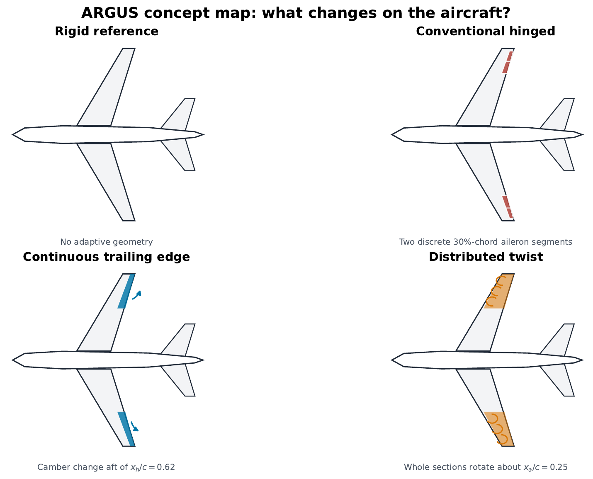
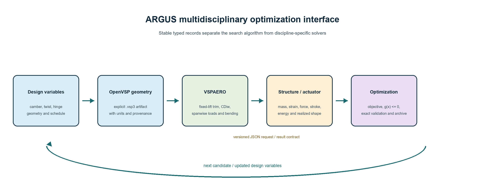

# ARGUS Aerodynamic Morphing-Wing Workflow

OpenVSP/VSPAERO geometry-generation, aerodynamic-evaluation, and optimization
workflows developed for the ARGUS outer-wing morphing study at TU Delft. The
repository is also the maintained starting point for subsequent aerodynamic,
structural, actuator, and multidisciplinary optimization work.

This public repository was produced within the **ARGUS research project**.
Original software and documentation are available under the
[BSD 3-Clause License](LICENSE); third-party software, NASA-derived material,
geometry, and branding retain their own terms. See
[NOTICE.md](NOTICE.md) for provenance and license scope.

This repository is the **curated project handover**, not a dump of every solver
run. It contains the maintained Python source, configuration templates, audited
summary tables, representative OpenVSP geometries, and enough documentation for
a new researcher to understand and continue the work. Large intermediate
VSPAERO databases, OCR material, presentations, and collaborator-owned RANS
files remain in the project archive.



## What the project does

The workflow compares four outer-wing concepts on a NASA Energy Efficient
Transport (EET) aspect-ratio-12 reference wing:

1. rigid reference wing;
2. conventional segmented hinged control surface;
3. continuous trailing-edge camber morphing; and
4. distributed section-twist morphing.

For every candidate, the code creates an explicit `.vsp3` geometry, trims the
wing-only VSPAERO model to the required lift, extracts spanwise loads and root
bending, checks constraints, and ranks exact solver evaluations. Surrogate
models propose additional candidates but never replace the final exact
VSPAERO validation.

## Main engineering conclusion

There is no universal aerodynamic winner between trailing-edge camber and
distributed twist.

- At the audited **early-cruise** point, trailing-edge camber gives a 1.424%
  far-field induced-drag reduction and distributed twist gives 1.031%, relative
  to the rigid wing. Both sit very close to the illustrative root-bending
  allowable, so this ranking is strongly constraint-dependent.
- At **late cruise**, the two morphing concepts are effectively tied:
  trailing-edge camber gives 4.302% and twist gives 4.313% reduction.
- In the corrected **Mach 0.10** comparison, trailing-edge camber leads twist by
  only 0.115 drag counts. This is below the useful resolution reported for the
  matched-mesh RANS comparison.

Therefore, the final down-selection should be based primarily on mechanical
evidence: actuator force, stroke, energy, mass, skin strain, torsional
stiffness, structural integration, and failure modes. The aerodynamic workflow
provides load distributions and candidate geometries for that decision; it does
not by itself justify a hardware selection.

See [docs/METHODOLOGY.md](docs/METHODOLOGY.md) and
[docs/RESULTS_AND_LIMITATIONS.md](docs/RESULTS_AND_LIMITATIONS.md) for the full
interpretation.

## Repository map

```text
.
|-- src/argus_workflow/           Stable cross-disciplinary Python interface
|-- interfaces/                   Versioned structural request/result schemas
|-- examples/                     Runnable coupling and optimizer examples
|-- docs/                         Handover, methods, corrections, and extension guides
|-- inputs/geometry/              NASA source model and corrected common baseline
|-- studies/
|   |-- argus_morphing/           Continuous aft-camber geometry and optimization
|   |-- argus_twist_morphing/     Distributed twist geometry and optimization
|   |-- argus_conventional_control_comparison/
|   |-- argus_corrected_cruise_comparison/
|   |-- argus_corrected_conventional_cruise/
|   |-- argus_mach01_comparison/
|   `-- audit/                     Cross-checks used during the final report audit
|-- results/                      Audited summary tables, figures, and selected geometries
`-- tools/                        Runtime configuration and repository checks
```

The recommended entry point for current work is
`studies/argus_corrected_cruise_comparison`. The three geometry generators remain in
their concept-specific study folders.

## Extension architecture



The historical study scripts remain available for full traceability. New work
should use the small typed package in `src/argus_workflow` as the stable
boundary between disciplines:

- a geometry generator receives named design variables and creates an explicit
  geometry artifact;
- an aerodynamic evaluator returns `CDiw`, lift, root bending, spanwise-load
  paths, and additional metrics;
- an optional structural evaluator receives a versioned JSON request and
  returns mass, strain, force, stroke, energy, feasibility, and normalized
  constraints; and
- any optimizer consumes the resulting objective and `g(x) <= 0` constraints.

This lets a structural model be attached as an external command without
editing VSPAERO scripts, and lets a new optimization algorithm reuse the same
geometry and solver definitions. See
[docs/STRUCTURAL_COUPLING.md](docs/STRUCTURAL_COUPLING.md) and
[docs/EXTENDING_OPTIMIZATION.md](docs/EXTENDING_OPTIMIZATION.md).

## Quick start

### 1. Install external software

- OpenVSP **3.50.1** (the version used for the final study), including VSPAERO.
- Python 3.11 or newer for optimization, analysis, and plotting.
- The OpenVSP-distributed Python interpreter/module for scripts that import
  `openvsp`.

OpenVSP itself is not redistributed in this repository.

### 2. Create the analysis environment

Windows PowerShell:

```powershell
py -3.11 -m venv .venv
.\.venv\Scripts\Activate.ps1
python -m pip install --upgrade pip
python -m pip install -r requirements.txt
python -m pip install -e .
```

Ubuntu/macOS:

```bash
python3 -m venv .venv
source .venv/bin/activate
python -m pip install --upgrade pip
python -m pip install -r requirements.txt
python -m pip install -e .
```

Detailed OS-specific OpenVSP guidance is in
[docs/CROSS_PLATFORM_SETUP.md](docs/CROSS_PLATFORM_SETUP.md). The Python
orchestration and interfaces are covered by CI on Windows, Ubuntu, and macOS;
scientific solver equivalence on a new platform must still be established by
reproducing the supplied baseline.

### 3. Generate machine-local configurations

Committed runtime configurations are templates and contain no author-specific
drive letters. Generate local versions with:

```powershell
python tools/configure_runtime.py `
  --openvsp-root "C:\OpenVSP-3.50.1-win64" `
  --openvsp-python "C:\OpenVSP-Python\python.exe" `
  --general-python ".\.venv\Scripts\python.exe"
```

Run `python tools/check_environment.py` afterwards. On Linux, supply the
corresponding OpenVSP and Python paths. The macOS process is documented in the
cross-platform guide.

### 4. Run tests before solver jobs

```powershell
python -m pytest studies/argus_morphing/tests
python -m pytest studies/argus_twist_morphing/tests
python -m pytest studies/argus_corrected_cruise_comparison/tests
python -m pytest tests
python tools/validate_repository.py
```

The solver-independent handover examples should also run on every platform:

```bash
python examples/structural_coupling/run_demo.py
python examples/custom_optimizer/random_search_demo.py
```

### 5. Reproduce or extend a study

Each study has its own README and numbered scripts. Run scripts from the study
directory, in numeric order, and start with a dry-run or a single geometry.
VSPAERO runs are the expensive step and create files under the ignored
`outputs/` directories.

For the final cruise comparison:

```powershell
cd studies\argus_corrected_cruise_comparison
python scripts\01_build_study_manifest.py
# Continue in the numbered order described in this study's README.
```

Do not assume that every historical config represents the final reported
metric. The audited decision results use the wake-plane/far-field induced-drag
coefficient `CDiw`, not the near-field `CDi` column.

## Trusted result set

The publication-ready numbers are in:

- [`results/cruise/final_concept_summary.csv`](results/cruise/final_concept_summary.csv)
- [`results/low_speed/final_concept_summary.csv`](results/low_speed/final_concept_summary.csv)
- [`results/selected_cases.csv`](results/selected_cases.csv)

Representative `.vsp3` files are under `results/geometries/`. They are included
for inspection and downstream CFD/structural transfer; the scripts remain the
source of truth for creating new designs.

## Corrections that must remain visible

The final audit found and corrected several issues from early project versions:

- inserted airfoil sections had been copied from an outboard neighbour instead
  of interpolated between bracketing sections;
- legacy dimensional moment and displacement columns mixed metre-based forces
  with feet-based geometry arms;
- the quantity once called a morph-region hinge torque was a moment about the
  aircraft reference, not a local actuator hinge moment;
- the illustrative 1050 N m hinge constraint and conclusions tied to it were
  withdrawn;
- final induced-drag ranking uses `CDiw` because near-field `CDi` was sensitive
  to wake discretization and did not provide the intended comparison;
- low-speed and transonic design studies answer different questions and their
  percentage improvements must not be mixed.

The complete correction history is in
[docs/AUDIT_AND_CORRECTIONS.md](docs/AUDIT_AND_CORRECTIONS.md).

## Scope and limitations

- Wing-only, rigid aerodynamic geometry; no aeroelastic coupling.
- VSPAERO is a low-order potential-flow method. The Mach 0.78 comparison is a
  concept-ranking study, not transonic certification-quality CFD.
- Root-bending limits are illustrative because no certified structural
  allowable was available. Early-cruise ranking changes when this limit moves.
- The model-scale Mach 0.10 RANS hinge moment is a method demonstration, not an
  actuator sizing load.
- Fuel-in-wing relief, actuator mass/energy, skin strain, failure modes, and
  control-system dynamics are outside this aerodynamic repository.

## License, data, and redistribution

NASA source material, OpenVSP, and collaborator RANS packages have their own
terms and provenance. This repository includes only the geometry and derived
artifacts selected for project handover. Original repository software and
documentation are released under BSD-3-Clause. This license does not relicense
NASA-derived geometry, OpenVSP/VSPAERO, collaborator material, institutional
branding, or other third-party assets. See [NOTICE.md](NOTICE.md) and complete
[docs/RELEASE_CHECKLIST.md](docs/RELEASE_CHECKLIST.md) before publishing a
tagged release.

## Continuing the project

- **Structural integration:** implement the request/result contract in
  `interfaces/` and follow the staged checks in
  [docs/STRUCTURAL_COUPLING.md](docs/STRUCTURAL_COUPLING.md).
- **Alternative optimization:** retain the evaluation contract and replace the
  search loop as described in
  [docs/EXTENDING_OPTIMIZATION.md](docs/EXTENDING_OPTIMIZATION.md).
- **New morphing concept:** implement the `GeometryGenerator` protocol, first
  reproduce the rigid baseline, then add one verified exact case before a
  design of experiments.
- **Contribution:** create a branch, keep generated solver files out of Git,
  add tests for contract changes, and follow [`CONTRIBUTING.md`](CONTRIBUTING.md).

The canonical repository is
[Liming-Zheng/ARGUS_Aerodynamic_Workflow](https://github.com/Liming-Zheng/ARGUS_Aerodynamic_Workflow).
It is public and can be cloned read-only over HTTPS:

~~~bash
git clone https://github.com/Liming-Zheng/ARGUS_Aerodynamic_Workflow.git
~~~

Contributors with GitHub write access may instead use SSH:

~~~bash
git clone git@github.com:Liming-Zheng/ARGUS_Aerodynamic_Workflow.git
~~~

SSH authenticates pushes; it is not required to read the public repository.
External contributors should normally fork the repository and open a pull
request. Direct write access remains controlled by the repository owner.

## Citation and contact

Use [`CITATION.cff`](CITATION.cff) when citing the software. The workflow was
developed by Liming Zheng at TU Delft for the ARGUS project. Project-specific
questions should be routed through the current ARGUS work-package lead after
handover.


